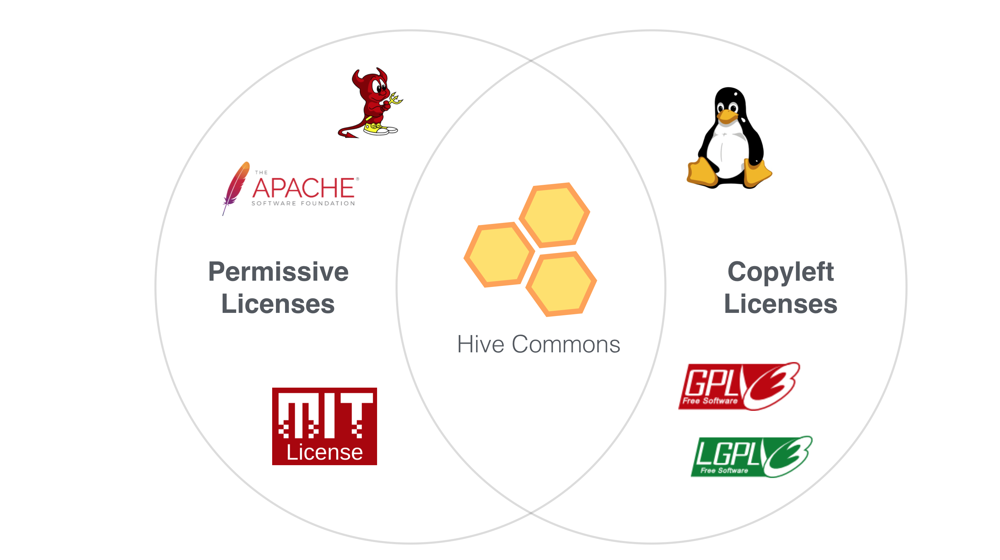

# Hive Commons License
## Goal
The goal of the the Hive Commons License for Open Source Software is to provide more a novel approach to Open Source licensing that offers some of the commercial flexibility of Permissive licenses, while strictly enforcing that usage of the software will always benefit the public. 

## User Stories
As an Altruistic Software Developer I want a guarantee that the software contributions I make will not be used for private gain at the expense of the public. 

As an Entrepreneur I would rather leverage existing software and build on top of it than reinvent the wheel, but I can’t be successful if I need to release my “secret sauce” to the public domain. 

As an Activist I want to be able to maximize the impact of my charitable donation by supporting the development of a shared commons that can only be accessed by “equitable” enterprises. 

## Functional and Technical Requirements
The HCL will be a derivative of the GPLv3 with the following addition

If the user of the software does not open source any derivative works under the HCL license they will still be in compliance with the terms of the license if their usage of the commons is determined to be in the communities best interest. 

In the event of a license compliance dispute, the “best interest” of the community will be determined by using the Hive Commons implementation of liquid democracy. 

## Feedback and Discussion
Feedback and discussion of this topic is welcome, feel free to reach out on [slack](https://hivecommons.herokuapp.com/) in the channel #license. Or if you prefer, create an issue to start a discussion here on github. 